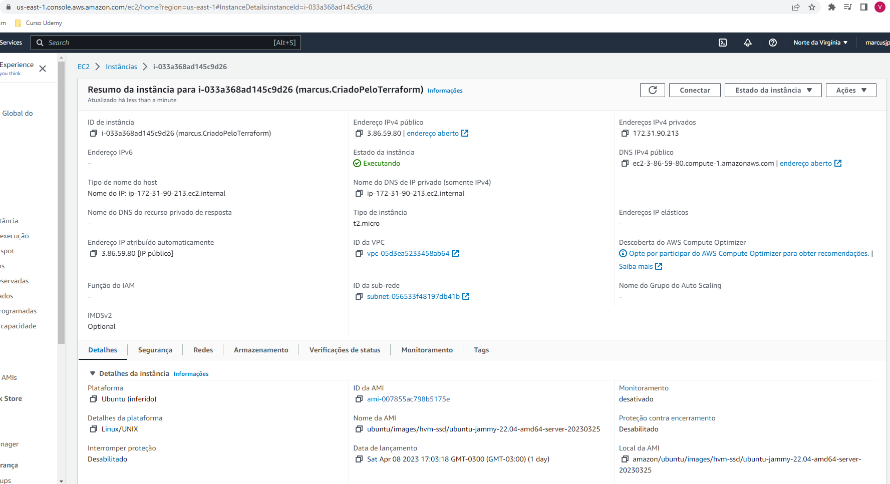

#Projeto de devops
Aluno: Marcus Vinicius Cardoso de Melo 
Disciplina: Integração Contínua e DevOps [23E1_3] 
Curso: Engenharia de Software em Java 

Para subir o Prometheus e Grafana é necessário digitar o comando:

docker-compose up

na pasta raiz do projeto.

Prometheus: http://localhost:9090/  
Grafana: http://localhost:3000/  

Swagger: http://localhost:8080/swagger-ui.html

#Print's

Prometheus, Actuator, Health Check, Grafana

Papertrail

Terraform + AWS
